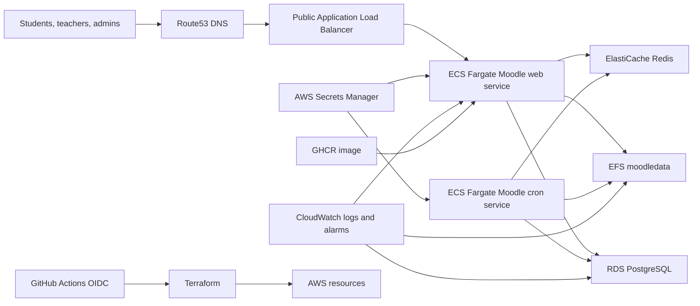

# AWS Moodle Architecture Blueprint

This document defines the target AWS operating model for eLearn Mindset Moodle and the validation checklist used before production changes.

## Current Target Architecture

## AWS Well-Architected Validation

### Reliability

| Check | Expected Standard |
| --- | --- |
| Multi-AZ networking | Public and private subnets span at least two Availability Zones. |
| Web scaling | Moodle web runs on ECS Fargate with desired count greater than one for shared environments. |
| Shared files | `moodledata` is on encrypted EFS with mount targets in private subnets and an enabled EFS backup policy. |
| Database recovery | RDS has automated backups, deletion protection for shared environments, final snapshots enabled outside dev, and Multi-AZ enabled for stage/prod. |
| Cron isolation | Moodle cron runs as a separate ECS service so upgrades can pause it without stopping web traffic. |
| Deployment rollback | ECS deployment circuit breaker is enabled. GitHub Actions waits for ECS stability and runs remote smoke checks. |
| Disaster recovery | RDS snapshot or PITR and EFS AWS Backup recovery points are captured before upgrade events. |

### Security

| Check | Expected Standard |
| --- | --- |
| AWS access | CI/CD uses GitHub OIDC and short-lived STS credentials. No SSH deployment path is required. |
| Secret storage | Database and Moodle admin passwords are generated and stored in AWS Secrets Manager. |
| Private data tier | ECS, RDS, Redis, and EFS run in private subnets. RDS is not public. |
| Encryption at rest | RDS, EFS, Redis, and Terraform state use encryption. Terraform state uses a customer-managed KMS key. |
| Encryption in transit | ALB HTTPS is enabled when `certificate_arn` is set; EFS transit encryption is enabled. |
| Image supply chain | Images are built from the configured Moodle tag, scanned by Trivy, and published to GHCR with immutable commit tags. |
| Least privilege | AWS roles are environment scoped. Additional tightening should be reviewed after the first successful production deployment. |

### Performance Efficiency

| Check | Expected Standard |
| --- | --- |
| PHP web tier | ECS task CPU/memory are sized per environment and autoscale on CPU and memory. |
| Cache | Redis is available for Moodle cache/session tuning. |
| Database | RDS storage autoscaling is enabled and Performance Insights is enabled for stage/prod. |
| Static and uploaded files | EFS elastic throughput is used for `moodledata`; lifecycle policies move cold files to IA. |
| Observability | CloudWatch alarms cover ALB unhealthy targets, ALB 5xx, ECS CPU/memory, RDS CPU/storage, and EFS I/O limit. |
| Load testing | Before production, run representative login, dashboard, course view, quiz, assignment upload, and cron workloads against stage. |

## Deployment Strategy

Current implementation uses ECS rolling deployments with:

- immutable GHCR image tags,
- ECS deployment circuit breaker with rollback,
- target group health checks on `/health`,
- ECS service stabilization waits,
- remote Moodle smoke tests after stage and production deployment,
- production approval through the `prod-approval` GitHub Environment.

Production zero-downtime target:

1. Keep the current ECS rolling deployment for normal patch releases.
2. For high-risk releases, add AWS CodeDeploy blue/green ECS deployments with two ALB target groups.
3. Shift traffic after health checks, synthetic checks, and Moodle CLI upgrade validation pass.
4. Roll back automatically when target health, ALB 5xx, ECS deployment, or synthetic checks fail before schema migration.

Moodle database schema upgrades are not fully reversible. After `admin/cli/upgrade.php` changes the schema, rollback must restore the database and `moodledata` together.

## State And Schema Strategy

Moodle upgrade events must treat application code, database schema, and `moodledata` as one change set.

1. Validate the official Moodle tag exists.
2. Capture RDS snapshot or PITR marker and EFS recovery point.
3. Record the active ECS task definition and GHCR image tag.
4. Pause cron and enable maintenance mode.
5. Deploy the new image with cron desired count `0`.
6. Run `php admin/cli/upgrade.php --non-interactive` once from a Moodle web task.
7. Purge caches.
8. Restart cron.
9. Run smoke checks and Moodle CLI health checks.

Rollback rules:

- Before schema upgrade: roll ECS back to the previous task definition.
- After schema upgrade: restore RDS and EFS to matching backup points, then roll ECS back to the matching image.
- Do not manually edit Terraform state to force rollback. Restore through AWS and reconcile with Terraform.

## Drift Management

The `Infrastructure Drift Detection` workflow runs refresh-only Terraform plans for dev, stage, and prod. It detects out-of-band changes without applying infrastructure.

Operator response:

1. Review the workflow summary.
2. If the drift was intentional, create a PR to encode it in Terraform.
3. If the drift was accidental, revert it in AWS or apply Terraform after approval.
4. Never use drift detection as a deployment workflow.

## RTO And RPO Targets

| Environment | RTO Target | RPO Target | Notes |
| --- | --- | --- | --- |
| Dev | Best effort | Best effort | Local and dev data can be recreated. |
| Stage | 4 hours | 24 hours | Should mirror production restore flow. |
| Prod | 2 hours | 1 hour for database, 24 hours for EFS unless scheduled backups are tighter | Final targets depend on AWS Backup schedules and business approval. |

## Production Readiness Checklist

- Route53 prod record and ACM certificate configured.
- GHCR package visibility and ECS registry credentials confirmed.
- RDS deletion protection enabled.
- RDS Multi-AZ and Performance Insights enabled.
- EFS backup policy enabled and AWS Backup vault tested.
- CloudWatch alarms routed to an SNS topic with a real responder path.
- Stage smoke and browser validations pass from the pipeline.
- Manual `Server Backup`, `Moodle Version Upgrade`, and `Server Restore` workflows tested in dev or stage.
- ADRs updated for any architecture exception.
