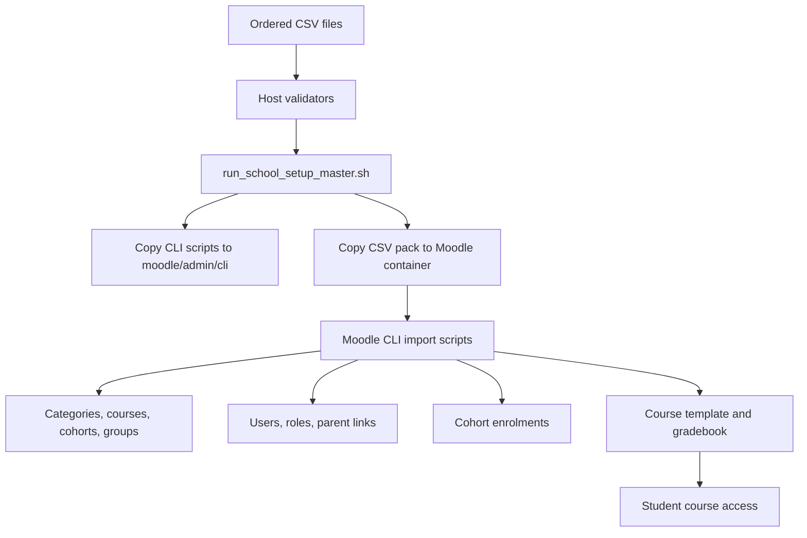

# Chapter 01: Overview and Architecture

| Previous | Documentation Home | Next |
|---|---|---|
| - | [CLI Pack README](../README.md) | [Chapter 02: Setup and Prerequisites](02-setup-and-prerequisites.md) |

## Purpose

The CLI pack creates a Moodle baseline for an Indian school. It models common CBSE, ICSE, state-board, and mixed-board operations with reusable CSV files and Moodle CLI scripts.

The pack is designed for repeatable setup:

- Import master school data.
- Build Moodle categories and courses.
- Create cohorts and groups for divisions.
- Create staff, student, and parent users.
- Link parents to students.
- Enrol cohorts into subject courses.
- Apply standard course templates and gradebook rules.
- Promote existing students to the next academic year.

## Moodle Mapping

| School Concept | Moodle Object | Notes |
|---|---|---|
| Trust or organisation | Course category | Optional top-level grouping. |
| Board | Course category | CBSE, ICSE, GSEB, etc. |
| School | Course category | One school under a board. |
| Medium | Course category | English, Hindi, Gujarati, etc. |
| Grade/Class | Course category | Std 1, Std 5, Std 11, etc. |
| Stream | Course category | `GEN`, `SCI`, `COM`; lower grades normally use `GEN`. |
| Subject | Moodle course | One course per subject and academic year. |
| Division | Moodle group | Division A/B/C inside each subject course. |
| Student batch | Moodle cohort | Year + board + school + medium + grade + stream + division. |
| Parent access | Parent role in user context | Linked to student user context. |

## Architecture Flow

## Import Layers

| Layer | Ordered Files | Result |
|---|---|---|
| Master data | `01_` to `09_` | School, boards, grades, streams, subjects. |
| Moodle structure | `10_` to `15_`, `25_` | Categories, courses, cohorts, groups, enrolments. |
| Users and roles | `16_` to `24_` | Profile fields, roles, staff, students, parents, links. |
| Template | `30_` to `43_` | Standard course sections, activities, gradebook, reports. |
| Rollover | `44_` to `59_` | Academic-year transition and promotion planning. |
| Support | `26_` to `29_`, `60_`, `61_` | Lookups, validation rules, references, compatibility. |

## Script Responsibilities

| Script | Responsibility |
|---|---|
| `run_school_setup_master.sh` | Main operator entry point. Copies scripts, copies pack, runs validation/import/template commands. |
| `cli_validate_school_baseline.php` | Validates baseline CSV relationships outside Moodle. |
| `cli_validate_course_template_csv.php` | Validates course-template CSV structure and chapter gates. |
| `cli_moodle502_preflight.php` | Checks Moodle runtime requirements before import. |
| `cli_import_indian_school_baseline.php` | Creates categories, courses, cohorts, groups, users, parent links, and enrolments. |
| `cli_create_universal_master_course_template.php` | Creates/reset the master standard course template. |
| `cli_apply_course_template_settings.php` | Applies template sections/settings to real courses. |
| `cli_apply_gradebook_template.php` | Applies gradebook structure to real courses. |
| `cli_prepare_next_academic_year.php` | Prepares next-year structures. |
| `cli_promote_academic_year.php` | Promotes students into next-year cohorts. |
| `cli_csv_helpers.php` | Resolves ordered CSV names such as `20_users_students.csv` from logical script names. |

---

| Previous | Documentation Home | Next |
|---|---|---|
| - | [CLI Pack README](../README.md) | [Chapter 02: Setup and Prerequisites](02-setup-and-prerequisites.md) |
